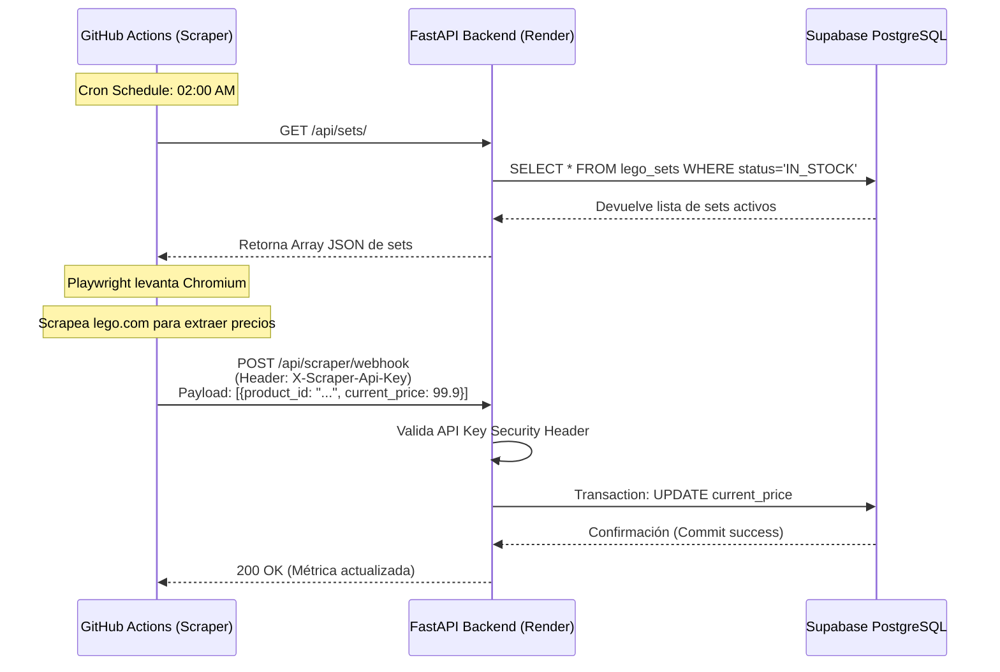

# Arquitectura Técnica: Almacenamiento de Sets y Motor de Scraping

Este documento técnico detalla el funcionamiento interno, el diseño de la base de datos y la arquitectura asíncrona del sistema de Scraping para **LEGO Stock Manager PRO**. El sistema está diseñado bajo un paradigma "Zero-Cost", separando de forma estricta el servidor web de las pesadas tareas de extracción de datos.

---

## 1. Diseño del Almacenamiento (Base de Datos)

El corazón del sistema es una base de datos relacional **PostgreSQL** alojada en Supabase. Se interactúa con ella utilizando el ORM **SQLAlchemy** desde FastAPI.

### Modelo de Datos (Schemas)

Existen dos entidades principales con una relación de *uno-a-muchos* (One-to-Many):

#### Tabla: `lego_sets`
Almacena el estado actual y los metadatos del inventario.
*   `id` (Integer): Primary Key interna.
*   `product_id` (String): El ID oficial de LEGO (ej. "75192"), indexado para búsquedas rápidas.
*   `buy_price` (Float): Precio al que se adquirió el set.
*   `current_price` (Float): Precio de mercado en tiempo real, **actualizado dinámicamente por el Scraper**.
*   `status` (Enum): Utiliza la clase `SetStatus` (`IN_STOCK` o `SOLD`).
*   `updated_at` (DateTime): Modificado automáticamente (trigger `onupdate`) cada vez que el scraper altera el precio.

#### Tabla: `sales`
Registra el histórico inmutable de las operaciones cerradas.
*   `lego_set_id` (ForeignKey): Relacionado con `lego_sets.id`.
*   `sell_price` (Float): Precio final de la venta.
*   `platform` (String): Plataforma de salida (Vinted, Wallapop).

> [!TIP]
> **Conexión IPv4 Proxy:** Debido a las restricciones de la capa gratuita de Render, la aplicación se conecta a la base de datos a través de un **Shared Pooler (Pgbouncer)** en el puerto 6543, lo que permite enrutar tráfico IPv4 de manera estable sin contratar IPs dedicadas.

---

## 2. El Motor de Scraping Desacoplado

El scraping web (especialmente usando navegadores *headless* como Chromium) consume enormes cantidades de memoria RAM (a menudo picos de más de 1GB). Ejecutar esto en el mismo servidor gratuito de Render (512MB RAM) causaría bloqueos "Out of Memory" (OOM).

Para solucionarlo, el scraper se ha diseñado como un **Worker Serverless Independiente**.

### Componentes del Scraper
*   **Playwright (Python):** Se utiliza `async_playwright` para levantar instancias invisibles de Chromium. Esto permite saltar barreras anti-bot sencillas y ejecutar el JavaScript de las páginas de destino (Lego.com o Bricklink) para extraer los precios reales renderizados en el DOM.
*   **Gestión asíncrona (`asyncio`):** Permite procesar múltiples peticiones de red sin bloquear el hilo principal.

---

## 3. Flujo de Ejecución e Integración (GitHub Actions)

El script de scraping no vive en el servidor web, se ejecuta bajo demanda utilizando los *runners* gratuitos de **GitHub Actions** (máquinas Ubuntu con 7GB de RAM provistas por Microsoft).

### Ciclo de Vida del Cron Job

El archivo `.github/workflows/scraper.yml` orquesta la automatización todos los días a las 02:00 AM UTC:

1.  **Levantamiento:** GitHub Actions inicia un contenedor Ubuntu.
2.  **Preparación:** Instala Python 3.11, descarga las dependencias (`pip install -r requirements.txt`) e instala los binarios del navegador con `playwright install chromium`.
3.  **Extracción de Tareas (Fase 1):** El script `scraper/main.py` hace un `GET` público a `/api/sets/` en tu servidor Render para obtener todos los sets que actualmente tienen estado `IN_STOCK`.
4.  **Ejecución (Fase 2):** Abre Chromium y navega producto por producto, parseando el HTML para capturar el precio de mercado actualizado.
5.  **Sincronización mediante Webhook (Fase 3):** Empaqueta todos los resultados en un array JSON y realiza un `POST` seguro al Webhook de la API.

---

## 4. Seguridad y el Webhook de Sincronización

El servidor de FastAPI expone la ruta protegida `POST /api/scraper/webhook`. 

### Autenticación
Dado que este endpoint altera los precios de la base de datos, está protegido por la dependencia `get_api_key`. Exige que la petición entrante incluya un Custom Header llamado `X-Scraper-Api-Key`. El valor debe coincidir exactamente con la variable de entorno `SCRAPER_API_KEY` del backend.

### Transacción Atómica
```python
# Extracto lógico del Webhook
for item in payload.prices:
    db_set = db.query(models.LegoSet).filter(
        models.LegoSet.product_id == item.product_id,
        models.LegoSet.status == models.SetStatus.IN_STOCK
    ).first()
    
    if db_set:
        db_set.current_price = item.current_price
db.commit()
```
El backend busca eficientemente cada set recibido en la BBDD, actualiza en memoria el campo `current_price` y, solo al finalizar todo el bucle, lanza un único `db.commit()`. Si hay un error a mitad de proceso, la transacción de SQLAlchemy no se consolida, protegiendo la integridad de la base de datos.

---

## Diagrama de Arquitectura Global



> [!CAUTION]
> **Gestión de variables:** Para que esta automatización funcione online, debes asegurarte de ir a los **Settings** de tu repositorio en GitHub $\rightarrow$ **Secrets and variables** $\rightarrow$ **Actions** y crear dos *Repository Secrets*: `API_BASE_URL` (tu URL de render) y `SCRAPER_API_KEY` (tu contraseña segura).
